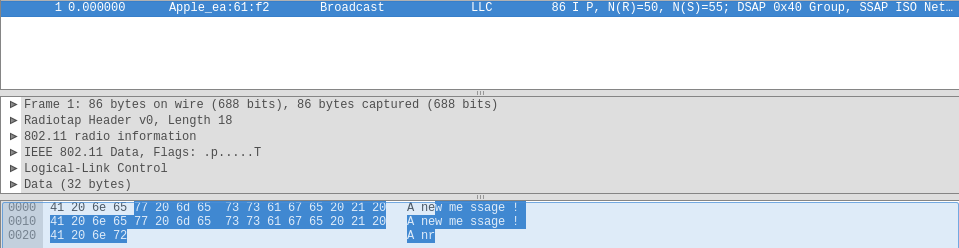
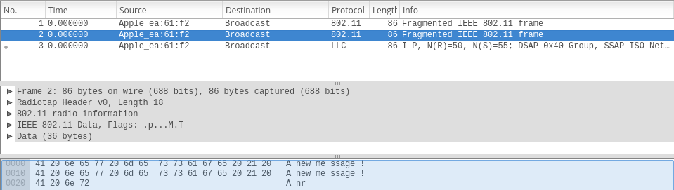
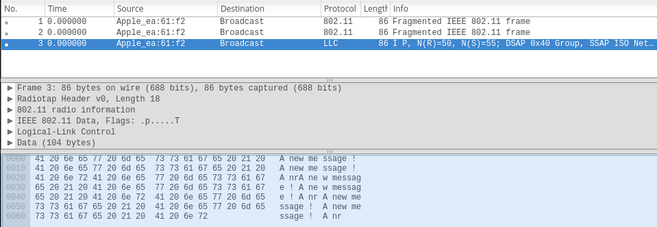

# Labo 2
*Yann Lederrey, Joel Schar*

## 1 Déchiffrement manuel de WEP

Rien de spécifique à dire ici, le script de déchiffrement a été analysé et pris comme exemple pour les scripts suivants.

## 2 Chiffrement manuel de WEP

code : manual-encryption.py

fichier wireshark : encrypt.cap

capture d'écran wireshark : 

*On peut voir la trame déchiffrée via wireshark :*

## 3 Fragmentation

code : manual-encryption-frag.py

fichier wireshark : encrypt-frag.cap

capture d'écran wireshark : 

*On peut voir un des fragments déchiffré via wireshark :*

*Ici on peut voir tout les fragments regroupés et déchiffrés* :

